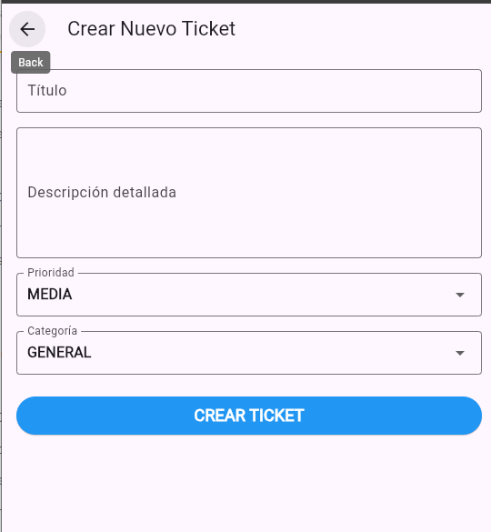
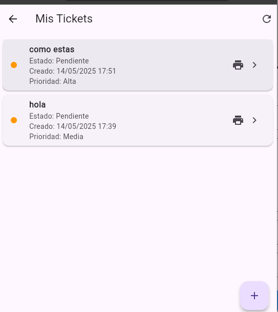

# 🎫 Sistema de Gestión de Tickets

Aplicación móvil desarrollada en Flutter que permite a los usuarios crear y visualizar tickets de soporte. Está integrada con Firebase (Firestore y Auth) y permite a los administradores gestionar los tickets en tiempo real.

---
## link del repositorio 
https://github.com/cristianquispelevano/sm2_examen_practico
## 📌 Descripción del Proyecto

Este sistema permite a los usuarios crear solicitudes de soporte (tickets), clasificarlos por prioridad y areas de la municipalidad de pocollay , y ver el estado en que se encuentran. Los administradores pueden revisar todos los tickets, actualizarlos, agregar comentarios y marcar su resolución.

---

## ✨ Funcionalidades implementadas (Historias de Usuario)
### ✅ autenticacion de usuario: nombre de usuario 
nombre usuario - hola
password - 456789

### ✅ Historia 1: Crear ticket

**Como usuario**, quiero poder registrar un ticket indicando un título, descripción, prioridad y categoría, para que el equipo de soporte atienda mi problema.

- Validación de campos en formulario
- Registro del ticket en Firestore
- Feedback visual al usuario

📸 **Captura de pantalla del formulario de creación:**

---

### ✅ Historia 2: Listar mis tickets

**Como usuario**, quiero poder ver la lista de todos los tickets que he creado, para hacer seguimiento del estado de mis solicitudes.

- Lista dinámica desde Firestore
- Visualización de estado, prioridad y fecha
- Exportación a PDF

📸 **Captura de pantalla del listado de tickets:**

---

## 🛠️ Tecnologías utilizadas

- **Flutter** – Framework principal
- **Firebase Auth** – Autenticación de usuarios
- **Cloud Firestore** – Almacenamiento de tickets y comentarios
- **PDF + path_provider** – Generación de archivos PDF

---

## 🗂️ Estructura del proyecto

lib/
├── model/
│ └── ticket_model.dart # Modelos Ticket y Comentario
├── services/
│ └── ticket_service.dart # Lógica de Firestore para tickets
├── screens/
│ ├── create_ticket_screen.dart # Pantalla de creación de tickets
│ └── view_tickets_screen.dart # Listado de tickets del usuario